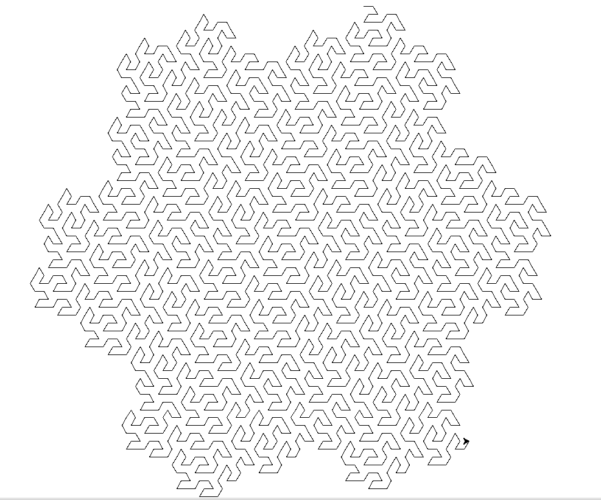

# Do you want to build a flowsnake?

If you asked me to pick my favourite fractal, it wouldn't even be close: it's this one. Mandelbrot called it the Peano-Gosper curve, 
but I much prefer its less formal name: the flowsnake.

I don't pretend to understand how Bill Gosper[^0] came up with it -- [this](https://larryriddle.agnesscott.org/ifs/ksnow/flowsnake.htm) provides a bit of insight into how it works -- but I understand enough to be able to code it up and watch Python's `turtle` draw it out mesmerisingly.

It can be described as a Lindenmeyer system (a method for describing fractals) as follows:

* Symbols: A and B mean "move forward"; + and - mean "turn left/right by 60 degrees".
* Starting string: "A"
* Every iteration:
    * Replace every "A" with "A-B--B+A++AA+B-"
    * Replace every "B" with "+A-BB--B-A++A+B"

(You might notice that the "B" replacement string is the "A" string reversed, and with the symbols switched).

There were two tricky things in the implementation, one annoying and one subtle.

The annoying thing was getting it to fit nicely in `turtle`'s default window. I could have set the dimensions explicitly, but I decided to employ trial and error instead.

The subtle one... if you implement the rules naively, you find that applying the second rule replaces the Bs that were inserted by the first rule in the iteration. While that's an interesting pattern (feel free to try it), it's not the flowsnake. Instead, I used lower-case for the inserted letters as a temporary measure, and then capitalised it all at the end.

I thought it was pretty. And pretty neat.

Colin ( colin@colinbeveridge.co.uk )

[^0]: I bumped into him, very briefly, at G4G, without recognising who he was. He was introduced to me as Bill and it was only afterwards I figured out who he was and shouted "THE Bill Gosper?!" Just as well, really. 
